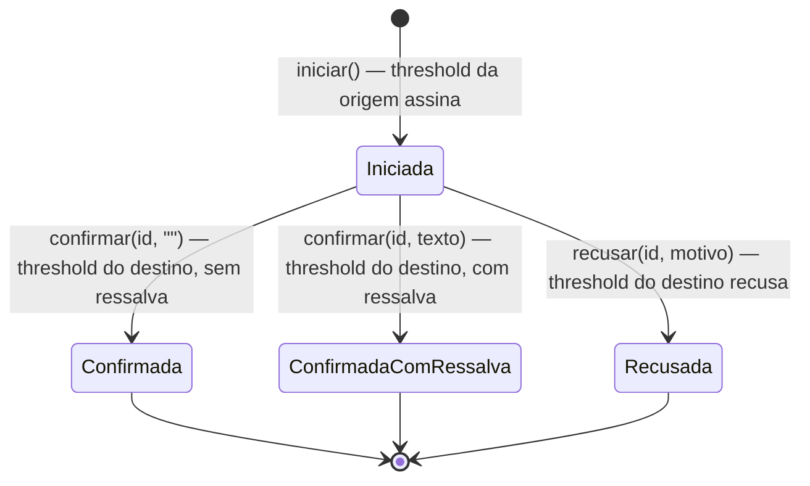
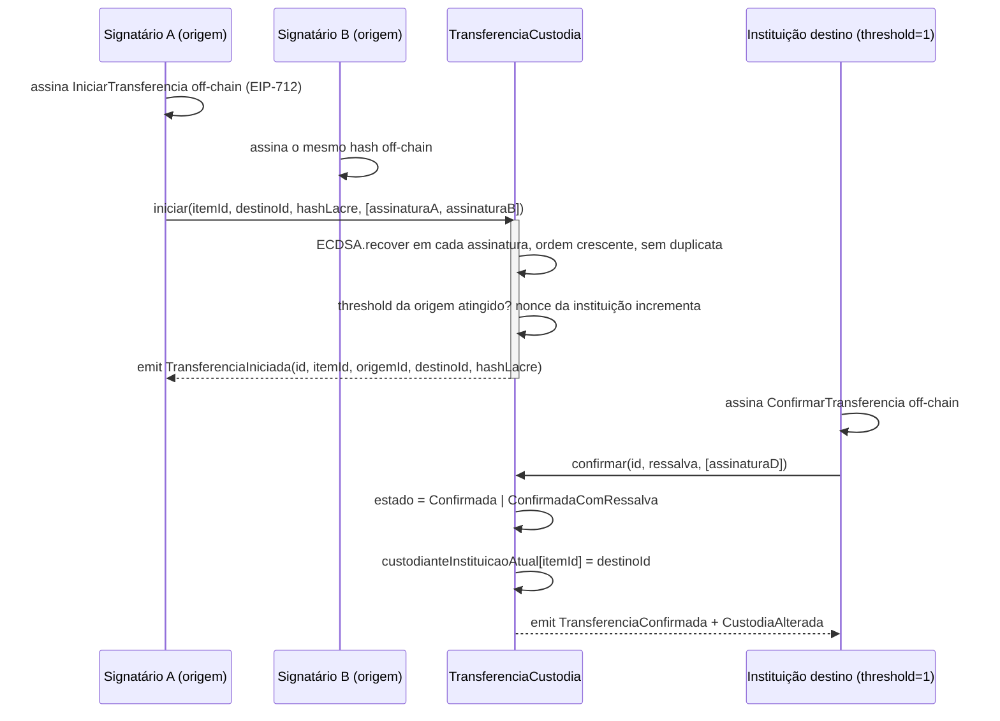
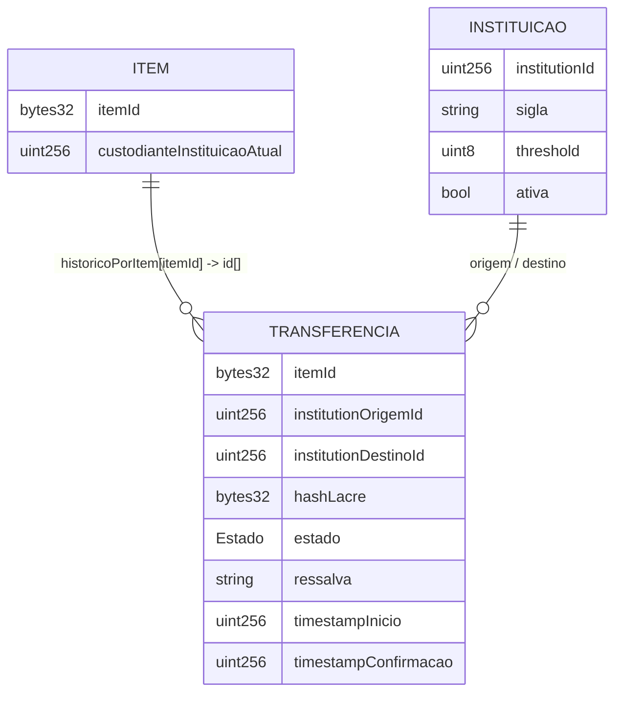
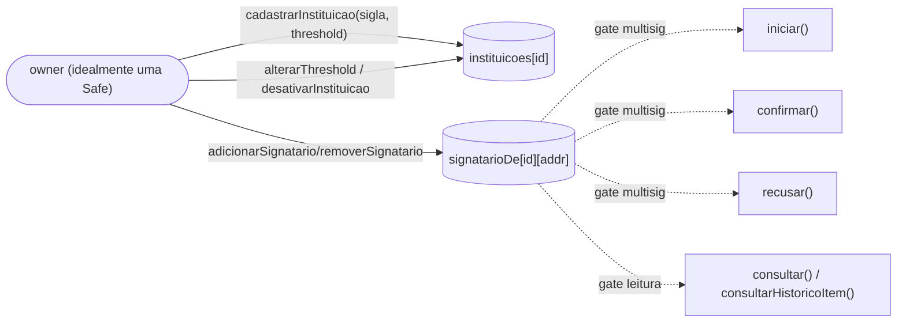

# Diagramas — TransferenciaCustodia.sol

## Estados da transferência

Enum `Estado`. Recebimento com ressalva é estado de 1ª classe, não exceção. Recusa é estado
próprio — custódia permanece com a origem.

## Multisig por instituição (assinatura EIP-712 agregada)

Cada instituição tem N-de-M signatários. `iniciar`/`confirmar`/`recusar` recebem um array de
assinaturas EIP-712 (assinadas off-chain, em ordem crescente de endereço) em vez de depender de
`msg.sender` como único signatário.

O `owner` do contrato (quem cadastra instituições e signatários) deve ser, em produção, uma
carteira multisig própria (ex: Gnosis Safe) — `transferirOwnership` + `aceitarOwnership` (duas
etapas) permitem migrar o owner do deployer inicial para a Safe sem risco de travar o contrato.

## itemId vs hashLacre

`itemId` é o hash único do **bem físico** — persiste por toda a cadeia de custódia, mesmo quando
o lacre muda a cada transporte. `hashLacre` é o selo físico **daquele transporte específico**;
uma vez usado, fica marcado (`lacreUtilizado`) e não pode ser reaproveitado por outro item.

`registrarItem(institutionId, itemId)` estabelece a custódia inicial (qualquer signatário da
instituição, sem threshold — ato de baixo risco comparado a uma transferência real). A partir
daí, só quem é `custodianteInstituicaoAtual[itemId]` pode iniciar uma nova transferência, e só
existe uma transferência pendente por item por vez (`transferenciaPendentePorItem`).

## Controle de acesso

`owner` cadastra instituições e signatários. Leitura (`consultar`/`consultarHistoricoItem`) é
liberada a qualquer endereço que seja signatário de alguma instituição — não só das partes
envolvidas naquela transferência (permite, por exemplo, que um juízo federal leia o histórico sem
pedir ao juízo estadual).

